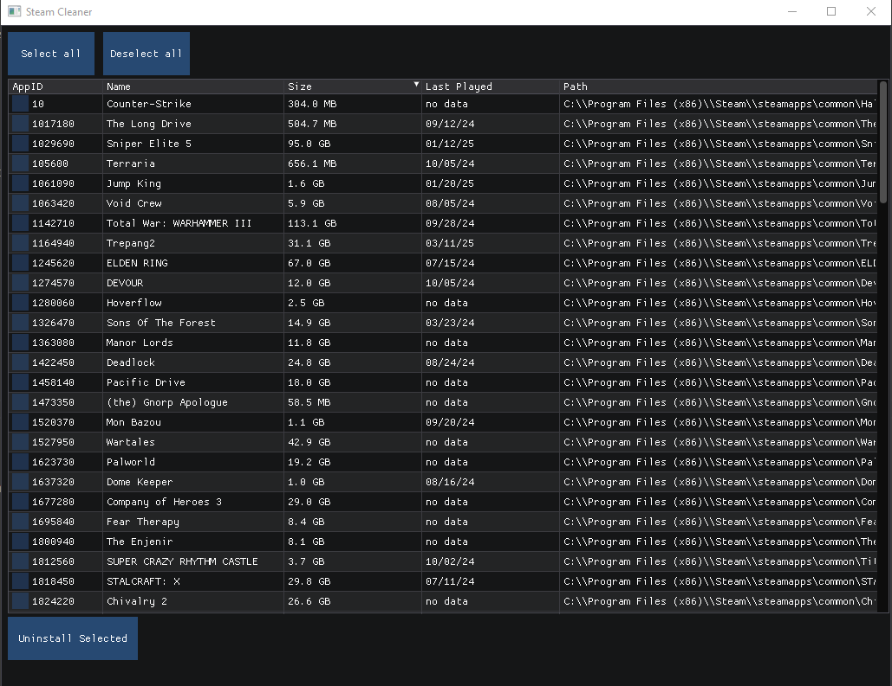

# Steam Cleaner
This is an application that helps you clean up your steam library. With steam cleaner you can bulk uninstall games that
- you haven't played in X amount of days
- are bigger than X size
- manually skip specific games
- manually choose a list of games to uninstall



# About
Steam Cleaner is written entirely in C, interfacing with win32 and using cimgui to interface with Dear Imgui


# How to Build
You will need to install MSYS2.

- Open UCRT64 MSYS2
- get build tools if you don't already have them
```
pacman -S mingw-w64-ucrt-x86_64-gcc
pacman -S git
pacman -S mingw-w64-ucrt-x86_64-cmake
```
- you may need to close and reopen UCRT64 MSYS2 if the above were just freshly installed.
```
git clone https://github.com/tylerwight/Steam_Cleaner
cd Steam_Cleaner
mkdir build
cd build
cmake ..
cmake --build .
```

The compiled program should be in <repo_path>/build/bin
